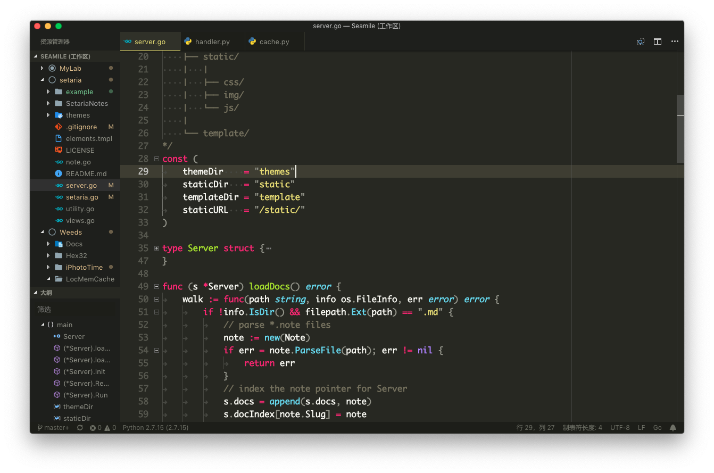

# Monokai Enhanced Theme

Monokai theme for VS Code


# Install from source

1. clone the code

    ```bash
    $ cd ~/.vscode/extensions
    $ git clone https://github.com/seamile/monokai-theme.git
    ```
2. reopen your vscode
3. choose the "Monokai Enhanced" theme

# Snap Screen


